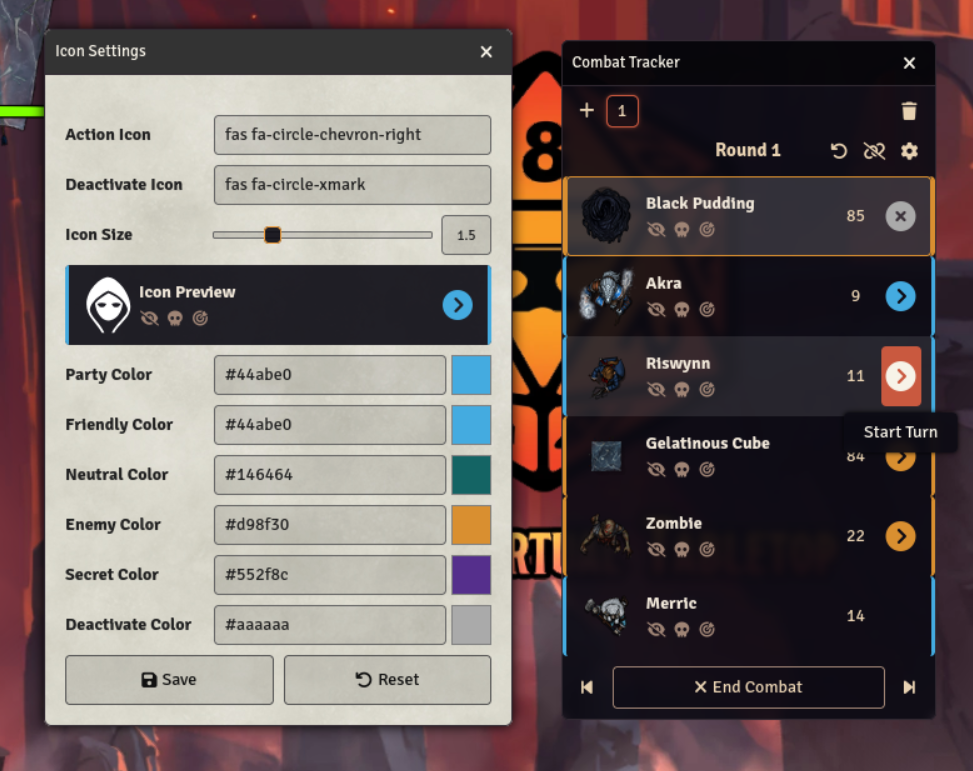

Lancer Initiative
=================

Lancer's initiative system for Foundry VTT. While intended for Lancer, this can be used to get popcorn style initiative on any system.
Lancer Initiative makes the following changes to the Foundry VTT turn tracker:

 * Sorts the initiative tracker by token disposition and then token name. The order is players, then friendly NPCs, then neutrals, then hostiles. Setting the initiative for an entry can change the sort order from within the category.
 * Replaces the Roll Initiative button and initiative display with an activation button. Clicking the button will set the current initiative to that token. Buttons are color coded by faction and greyed out for tokens that have already acted.
 * Adds the option to sort the tracker by activation status. With the option enabled, the current comabtant will be displayed first, and combatants with no remaining turns will be displayed last.
 * Initiative rolling can be re-enabled on systems that have an inititaive formula defined. The button and initiative display is moved to the combatant controls under the name.
 * Adds options to the combatant context menu to add, remove and reset activations.

Installation
------------

### Recommended

Install from the Foundry module installation dialog by searching for ‘Lancer Initiative’.

### Manual

Paste the following url into the install module dialog in Foundry VTT: https://codeberg.org/bolts/lancer-initiative/releases/latest/download/module.json

